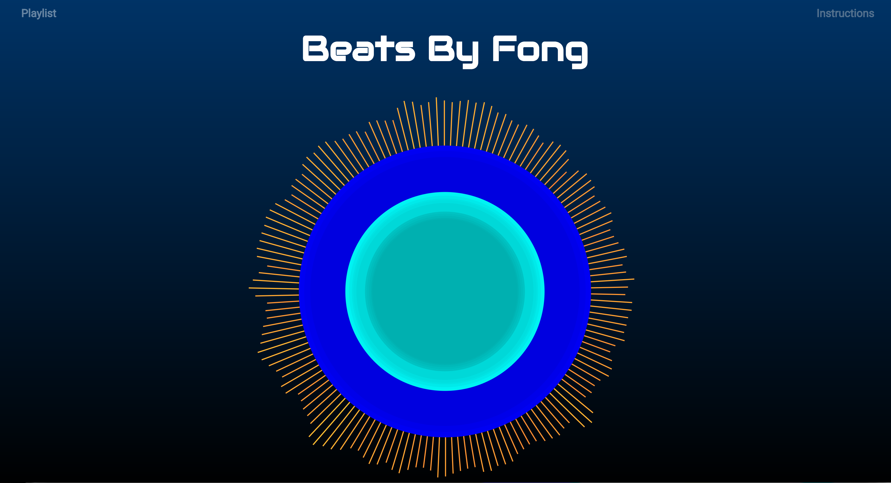

## Beats By Fong

[Beats By Fong Live][github]

[github]: https://ryancfong8.github.io/javascript-project/
### Background

Beats By Fong is an interactive dynamic musical web app that creates a visualization of the audio that the user generates.  Users can play different percussion instruments by pressing any letter key. Users can also add popular vocal interjections to their songs by pressing the number keys above the letter keys. Users can select a song from the playlist to drum along to, or add their own beat.



## Implementation

Beats By Fong makes use of a number of different libraries to generate the visualization, including the `Web Audio API`, `d3`, and `Howler.js`.

### Web Audio API

Beats By Fong uses the `Web Audio API` to grab an array of frequencies that have been generated by the audio.  The audio is fetched and passed through an analyser node before it is played. This analyser converts the audio into an array which then can be passed to a `d3` object that will use this data to generate an animation.

```javascript
const audioCtx = new (window.AudioContext || window.webkitAudioContext)();
const analyser = audioCtx.createAnalyser();
const analyser2 = audioCtx.createAnalyser();
let source;


source = audioCtx.createBufferSource();
let request = new XMLHttpRequest();

request.open('GET', `./audio/${sound}.mp3`, true);

request.responseType = 'arraybuffer';


request.onload = function() {
  let audioData = request.response;

  audioCtx.decodeAudioData(audioData, function(buffer) {
      source.buffer = buffer;

      source.connect(analyser);
      source.connect(audioCtx.destination);
  };
};

frequencyData = new Uint8Array(num_of_frequencies);
analyser.getByteFrequencyData(frequencyData);

```

### D3

Beats By Fong uses the `d3` library to create objects that will change based on the data that it is given.  In this case, circles and rectangles were created, with their size and color dependent on the data being passed. For the center animation, 175 concentric circles were placed, each representing a different frequency.  

```javascript

svg.selectAll('circle')
  .data(frequencyData)
  .attr('r', function(d) {
    return d * .75;
  })
  .attr('fill', function(d) {
    return 'rgb( 0, ' + (d) + ', ' + (d) + ')';
  });


```

The rectangular bars were placed in a circular pattern also concentric to those circles and transformed to expand outwards from the circle. The calculation from cartesian to polar coordinates need to be done in order for these bars to be in the correct place.

```javascript

svg.selectAll('rect')
   .data(frequencyData.slice(25))
   .enter()
   .append('rect')
   .attr('x', function (d, i) {
      return cx + Math.round(barRadius * (Math.cos(theta[i])));
   })
   .attr('y', function (d, i) {
      return cy + Math.round(barRadius * (Math.sin(theta[i])));
   })
   .attr('transform', function (d, i) {
     return 'rotate(' + (i *(360/bars) + 180) + ',' + (cx + Math.round((barRadius) * (Math.cos(theta[i])))) + ',' + (cy + Math.round((barRadius) * (Math.sin(theta[i])))) + ')'
   })
   .attr('width', Math.PI * (barRadius) * 2 / bars);

```

### Sounds

All sounds are stored locally in mp3 files.  Each time a key is pressed, `Howler.js` will make a new sound object; to be passed through the analyser and to the speakers.  This is preferred over playing an audio element because the same sound can be played over and over without having to wait for that same audio element to finish playing.

```javascript
  document.onkeydown = function(e) {
    let soundId = sounds[e.keyCode];
    let sound;
    if (soundId) {
      sound = new Howl({
        src: [soundId]
      });
    }
  sound.play();
```

## Future Plans

Future plans for this project will include more functionality and more DJ-like features. The following are future ideas for the project

- Ability to save songs
- Ability to upload and play song
- Ability to rewind and fast forward songs
- Add different animations/visualizations
